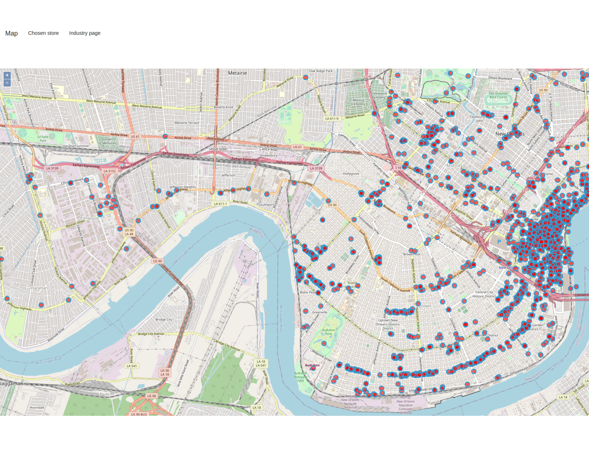
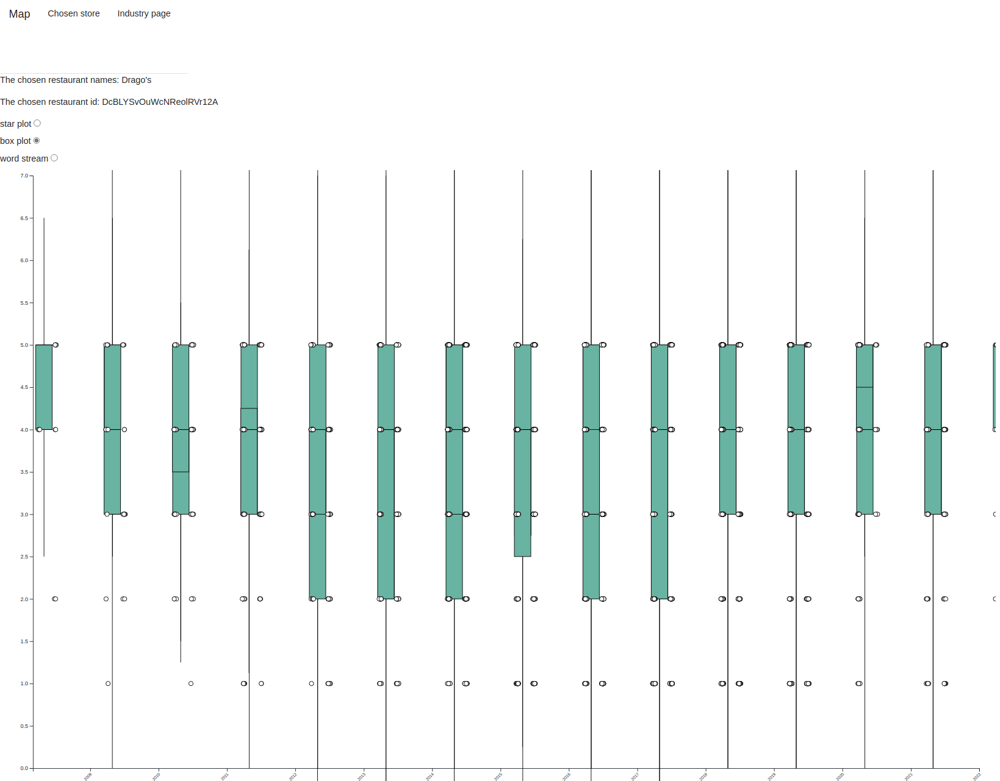
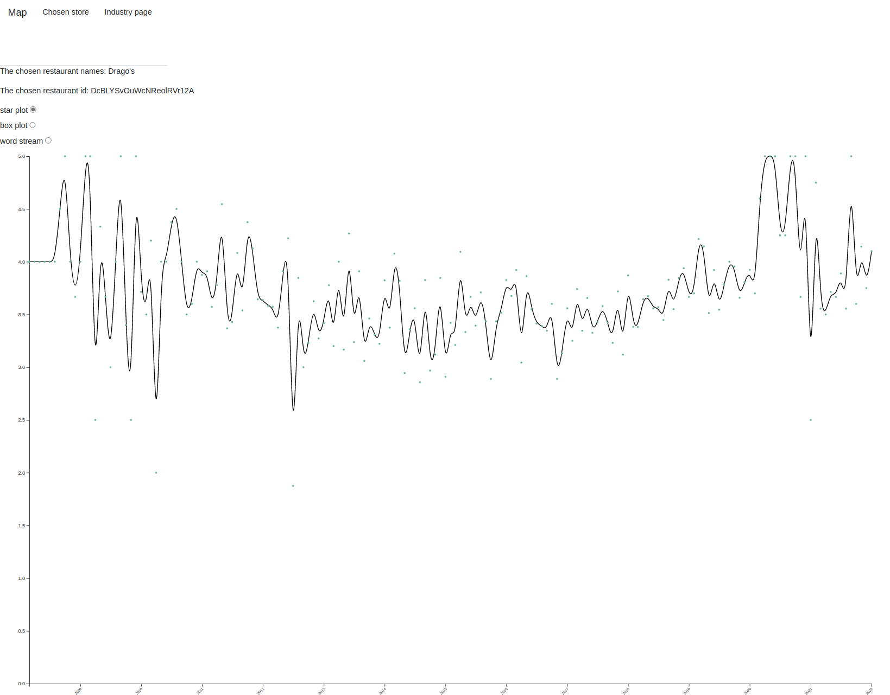
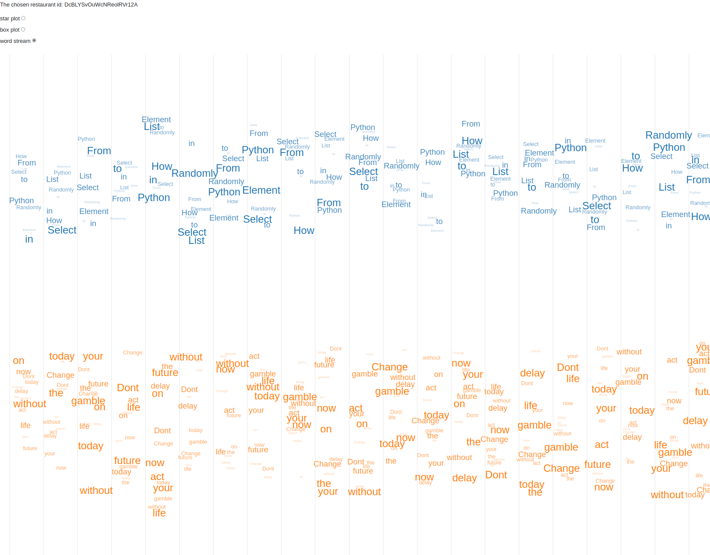
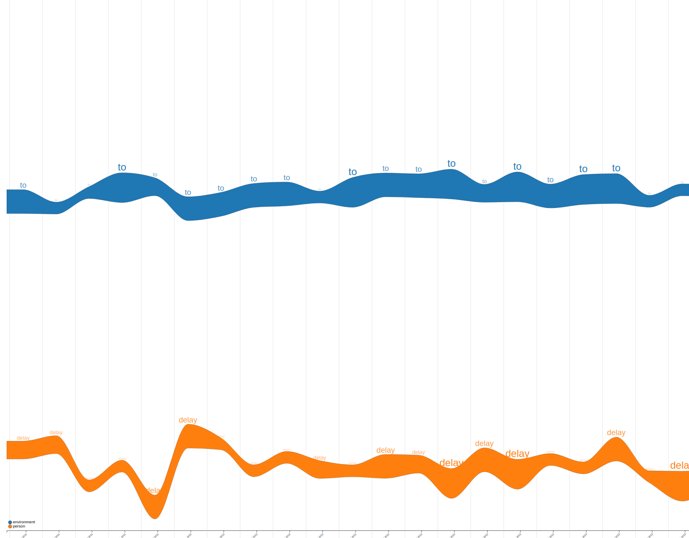

# Yifan Song's ARTS-1422 project: Dara visualization
This is a visualization of the yelp dataset which contains a map, a word stream plot, a scatter plot and a box plot.
This project is done with Vue and D3js for the front end part and flask and pandas for the back end parts.
We are rookies in html, css and more so the web page is ugly, sorry for that.

## Run instruction

If you use vscode, use Ctrl+Shift+P,
task: run tasks > task: install dependencies > task: run task: start app

if not in vscode(recommended)
run npm install in both front end and back end.
Then run npm run start in both front end and back end.
```ps1
cd backend
pip install flask pandas
flask run -p 3001
```
```ps1
cd frontend
npm install
npm run start
```

The index for the web page should be:
http://localhost:3000/map

## Demo






